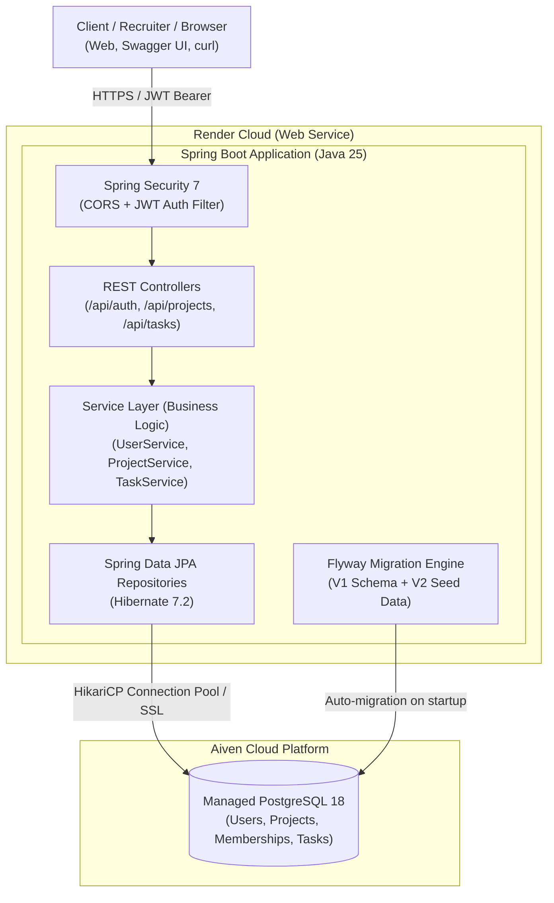
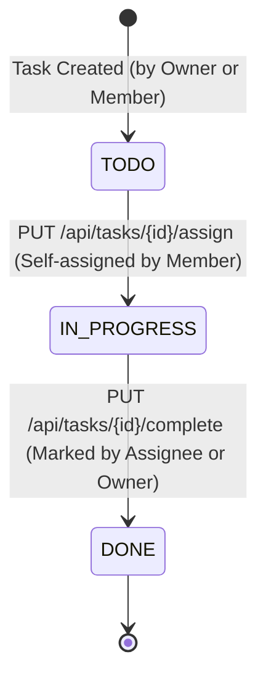

# Task Management API

[](https://openjdk.org/)
[](https://spring.io/projects/spring-boot)
[](https://www.postgresql.org/)
[](https://task-management-api-f6vd.onrender.com/swagger-ui/index.html)
[](https://task-management-api-f6vd.onrender.com/swagger-ui/index.html)

A production-grade, multi-tenant RESTful API for managing workspaces, projects, tasks, and team collaboration. Built with **Java 25** and **Spring Boot 4**, featuring stateless **JWT authentication**, **role-based access control (RBAC)**, an action-constrained **task state machine**, and automated database migrations via **Flyway**.

---

##  Live Demo & Interactive Documentation

>  **Interactive Swagger UI:** [**https://task-management-api-f6vd.onrender.com/swagger-ui/index.html**](https://task-management-api-f6vd.onrender.com/swagger-ui/index.html)  
> 📄 **OpenAPI Specification (JSON):** [`/v3/api-docs`](https://task-management-api-f6vd.onrender.com/v3/api-docs)

> [!TIP]
> **Recruiter & Evaluator Sandbox (Pre-Seeded Accounts)**  
> The live deployment is pre-seeded with test users, a showcase project, and tasks in each stage of the lifecycle:
> - **Demo User:** `username: demo` | `password: demo1234` *(Project Owner)*
> - **Collaborator 1:** `username: alice` | `password: alice1234` *(Project Member)*
> - **Collaborator 2:** `username: bob` | `password: bob1234` *(Project Member)*
>
> **Quick Test in 30 Seconds via Swagger UI:**
> 1. Open the [Swagger UI](https://task-management-api-f6vd.onrender.com/swagger-ui/index.html).
> 2. Execute `POST /api/auth/login` with `demo` / `demo1234` to get your JWT token.
> 3. Click the top **Authorize 🔓** button and paste the token.
> 4. Test any protected project or task endpoint directly from your browser!

*(Note: Render free instances spin down after inactivity. Initial request may take ~30-40 seconds for cold start).*

---

##  System Architecture



---

##  Key Engineering Highlights

- **Stateless JWT Authentication:** Implemented per-request bearer token validation using JJWT and custom `OncePerRequestFilter`, decoupling auth state from server memory.
- **Multi-Tenant Role-Based Access Control (RBAC):** Granular permission model differentiating project `OWNER` (full project administration, membership control, deletion) and `MEMBER` (task execution and collaboration).
- **Constrained State Machine Design:** Task status transitions are modeled as distinct business operations (`/assign`, `/complete`) rather than arbitrary status updates, preventing invalid state jumps.
- **Layered Clean Architecture & DTO Separation:** Strict domain isolation using Java 25 records as DTOs—JPA entities are never leaked to API consumers.
- **Centralized Error Handling:** Global `@RestControllerAdvice` translating custom domain exceptions (`ResourceNotFoundException`, `ForbiddenException`, `InvalidStateException`, `DataIntegrityViolationException`) into uniform, RFC-compliant JSON responses.
- **Automated Schema Migrations:** Managed PostgreSQL schema evolution and idempotent seed data using **Flyway**, ensuring identical database environments across Docker and cloud platforms.
- **Containerized Multi-Stage Build:** Multi-stage `Dockerfile` optimizing build size and execution on `eclipse-temurin:25-jre`.

---

## Task Lifecycle State Machine



---

##  API Overview

### 1. Authentication (`/api/auth`) — Public
| Method | Endpoint | Description |
|---|---|---|
| `POST` | `/api/auth/register` | Register account, returns JWT bearer token |
| `POST` | `/api/auth/login` | Authenticate with username & password, returns JWT token |

### 2. Projects (`/api/projects`) — Authenticated (Bearer Token)
| Method | Endpoint | Description | Permission |
|---|---|---|---|
| `POST` | `/api/projects` | Create a new workspace project | Authenticated User |
| `GET` | `/api/projects/{id}` | Get project metadata & owner details | Project Owner / Member |
| `PUT` | `/api/projects/{id}` | Update project name or description | Project Owner Only |
| `DELETE`| `/api/projects/{id}` | Delete project and cascade delete tasks | Project Owner Only |
| `GET` | `/api/projects/{id}/members` | List all members and roles | Project Owner / Member |
| `POST` | `/api/projects/{id}/members` | Add a member by username | Project Owner Only |
| `DELETE`| `/api/projects/{id}/members/{username}` | Remove a member | Project Owner Only |

### 3. Tasks (`/api/tasks` & `/api/projects/{id}/tasks`) — Authenticated
| Method | Endpoint | Description | Permission |
|---|---|---|---|
| `POST` | `/api/projects/{id}/tasks` | Create task inside project (Status: `TODO`) | Project Owner / Member |
| `GET` | `/api/projects/{id}/tasks` | List all tasks in project | Project Owner / Member |
| `PUT` | `/api/tasks/{id}/assign` | Self-assign task (`TODO` $\rightarrow$ `IN_PROGRESS`) | Project Member |
| `PUT` | `/api/tasks/{id}/complete` | Mark complete (`IN_PROGRESS` $\rightarrow$ `DONE`) | Assignee or Owner |

---

##  Local Development & Quick Start

### Option A: Docker Compose (All-in-One)
Spins up both the Spring Boot application and a local PostgreSQL instance:

```bash
# Clone the repository
git clone https://github.com/your-username/task-management-api.git
cd task-management-api

# Start services
docker compose up --build
```
The API and Swagger UI will be available at `http://localhost:8080/swagger-ui/index.html`.

### Option B: Local Gradle Run
Prerequisites: JDK 25 and running PostgreSQL instance.

```bash
# Run tests
./gradlew test

# Start API application
./gradlew bootRun
```
On Windows:
```powershell
.\gradlew.bat bootRun
```

---

## 🧪 Testing & Code Quality

- **Service Layer Coverage:** Mockito and JUnit 5 unit tests for `UserServiceTest`, `ProjectServiceTest`, and `TaskServiceTest`.
- **Validation & Constraint Testing:** Jakarta Bean Validation testing verifying payload boundary conditions and data integrity rules.

Run test suite:
```bash
./gradlew test
```

---

## 🛠️ Technology Stack

| Layer | Technology | Purpose |
|---|---|---|
| **Runtime** | Java 25 | Latest OpenJDK runtime features & records |
| **Framework** | Spring Boot 4.0.6 | REST API framework & auto-configuration |
| **Security** | Spring Security 7 + JJWT | Stateless JWT authentication & authorization |
| **ORM / Data** | Spring Data JPA + Hibernate 7 | Persistence abstraction & entity relations |
| **Database** | PostgreSQL 18 (Aiven Cloud) | Relational database with foreign key constraints |
| **Migrations** | Flyway 11 | Version-controlled DDL migrations & demo seed data |
| **API Docs** | Springdoc OpenAPI 3 + Swagger UI | Interactive living API documentation |
| **Container** | Docker + Docker Compose | Multi-stage containerized deployments |
| **Cloud** | Render | Managed cloud application hosting |
